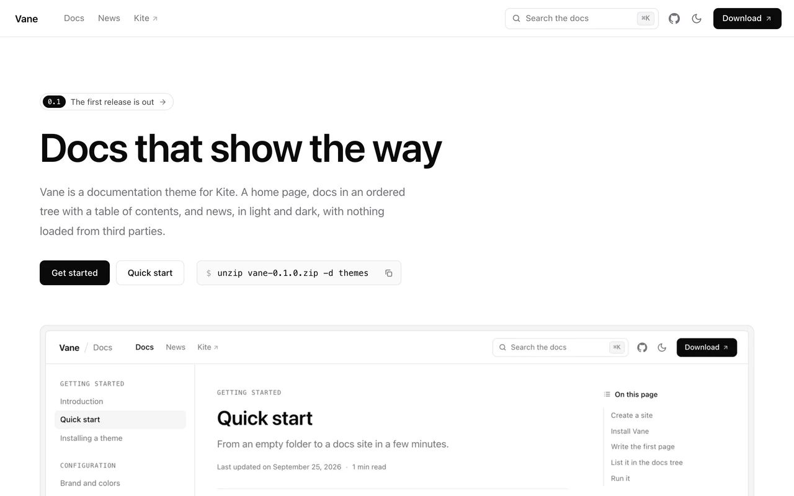

# Vane

Vane is a documentation theme for [Kite](https://github.com/kite-plus/kite):
a home page, documents in a tree with their own order, news, and search, in
light and dark. It is named after the weather vane, which turns to show
which way the wind blows: a docs site is there to show the way, and Kite
flies on the wind.



It is the theme [www.kite.plus](https://www.kite.plus) is to be built with,
and the second theme written against Kite's theme contract, which freezes
once a theme this different from the default one has been written.

Vane lives only in this repository. Kite ships just its default theme and
does not bundle this one.

## What it draws

Vane is drawn in black, white and grays, with hairlines where other themes
put gray panels. The accent color you choose marks only the underline of
links, the keyboard focus and the matches of a search.

- **A home page**: a badge for news, a headline, buttons and a command a
  reader can copy, a wide screenshot in a frame, a numbered grid of features,
  and the latest news.
- **Docs** in the groups and the order you set, each page with the tree
  beside it, the time it takes to read, a table of contents, and links to the
  pages before and after it.
- **Code blocks** with a bar that names the language, such as Terminal or
  YAML, and a button that copies the code. Kite writes the language of a
  block from its next release on; with Kite 0.1 the bar is left out and the
  button floats over the code.
- **Search**: by title across the docs tree, from `/` or `Ctrl K`. With the
  official [Search](https://github.com/kite-plus/plugin-search) plugin on the
  site, the box in the header opens its search of the whole text instead.
- **News** from Kite's posts, with tags, categories and an RSS feed.

Every page works without a script, and nothing is loaded from a third party.

## Using it

Drop the zip of a release on the upload tile under **Settings → Theme** in
Kite's studio, or unzip it into a site's `themes` folder and set `theme.name`
to `vane` in `kite.yaml`. Then list the docs in the docs tree, the way
[the example site's kite.yaml](example/kite.yaml) does. Every setting is
described in [the settings reference](example/content/pages/settings-reference.md).

Vane asks for Kite 0.1 or later.

## Developing it

[`example/`](example) is a Kite site that uses the theme through a link,
`themes/vane` to the root of this repository, and that documents the theme
at the same time:

```sh
cd example
kite run
```

A change is ready when both of these pass:

```sh
kite theme verify .
(cd example && kite build --verify)
```

## Releasing

`scripts/package.sh` packs `dist/vane-<version>.zip`, one folder named
`vane` holding `theme.yaml` and what the theme is made of, which the studio
installs as it is. Tag the release and attach the zip.

## Design

The plan, with what Kite has to add for the rest of it, is in
[docs/design/README.md](docs/design/README.md).

## License

[Apache License 2.0](LICENSE).
